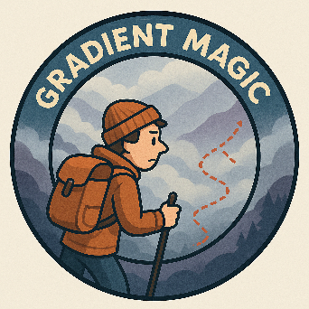

# Realm of Python

This repository is a collection of Python code snippets, examples, and best practices. It is part of a larger effort to provide hands-on experience with different aspects of Python. It does not aim to replace comprehensive resources; rather, it provides a quick reference for some common problems and solutions. It can also be used as presentation material in some cases.

It was partly used as supporting material for various presentations and workshops I have given since 2023. The topics covered by this repository include:

## Workshop Sessions

### Comprehensive Workshops
* **[Python 101 Workshop](./python_101_workshop/)** - A 3x3h hands-on workshop covering Python fundamentals for JavaScript developers transitioning to Python (May 2025)
* **[Astral UV Workshop](./astral-uv-workshop/)** - Opinion-based walkthrough on how to use Astral UV properly for Python dependency management (February 2025)  
* **[Python Typing Workshop](./typing_workshop/)** - Comprehensive guide to Python type hints, generics, and edge cases (August 2025)

### Deep Dive Topics
* **[PyTorch Neural Network](./pytorch_neural_network/)** - Reimplementation of gradient descent based on Andrej Karpathy's explanation with Jupyter notebooks (June 2025)
* **[Advanced Inheritance](./advanced_inheritance/)** - Comprehensive exploration of Python inheritance, including metaclasses, multiple inheritance, and the diamond problem
* **[Asynchronous Code](./asynchronous_code/)** - Process vs Thread vs Asyncio comparison with performance optimization examples (January 2025)
* **[Dependency Injection](./dependency_injection/)** - Custom implementation of dependency injection patterns inspired by Python DI libraries (May 2025)

### Code Examples & Edge Cases
* **[Edge Cases](./edge_cases/)** - Collection of Python edge cases, descriptors, dunder methods, and unusual behaviors
* **[Main Playground](./playground.py)** - Quick experiments and code snippets

## Badges

I created a system of badges to encourage people to share about different technologies — each badge is a generated image that humorously represents the content of a presentation. Here are examples of badges I made for my presentations:

**Explanation of gradients (how PyTorch works internally):**



**How to use Astral UV properly:**
  


## Environment Setup

I recommend using Astral UV from February 2025 onwards. See the [astral-uv-workshop](./astral-uv-workshop/) folder for detailed guidance on proper UV usage. Each project folder should have its own `pyproject.toml`. If not present, you can use any generic Python environment.

```bash
uv sync
```

## Repository Structure

### Workshop Materials
- **`python_101_workshop/`** - Complete 3x3h workshop materials for Python fundamentals
- **`astral-uv-workshop/`** - Comprehensive guide to Astral UV dependency management
- **`typing_workshop/`** - Python type hints and advanced typing concepts

### Advanced Python Concepts  
- **`advanced_inheritance/`** - Inheritance patterns, metaclasses, and complex class hierarchies
- **`asynchronous_code/`** - Async programming, performance optimization, and concurrency patterns
- **`dependency_injection/`** - Custom DI implementation with tests
- **`edge_cases/`** - Python edge cases, descriptors, dunder methods, and unusual behaviors

### Specialized Topics
- **`pytorch_neural_network/`** - Neural network implementation from scratch with gradient descent
- **`imgs/`** - Workshop badges and presentation images

### Quick References
- **`playground.py`** - Root-level experimentation file
