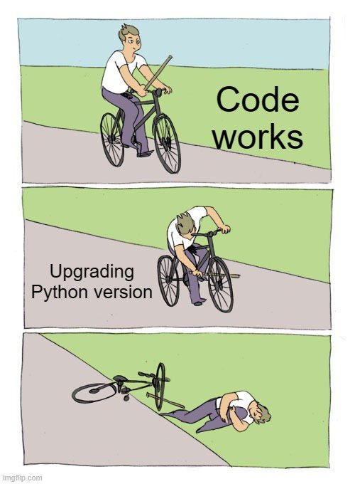
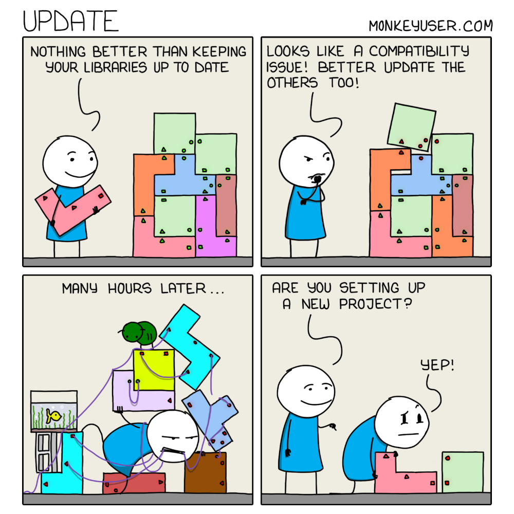

# Why .. tell me why

Why is Dependency Management Important?
* Version Compatibility: Different versions of a library may have different features, bug fixes, or breaking changes. Proper dependency management ensures that your project uses the correct version of each library to avoid compatibility issues.
* Reproducibility: By clearly defining the dependencies and their versions, other developers (or even yourself in a different environment) can easily recreate your development environment and ensure that the code runs as expected.
* Isolation: Isolating dependencies for each project helps prevent conflicts between different projects that may require different versions of the same library.